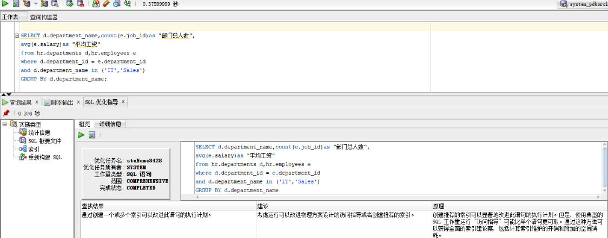
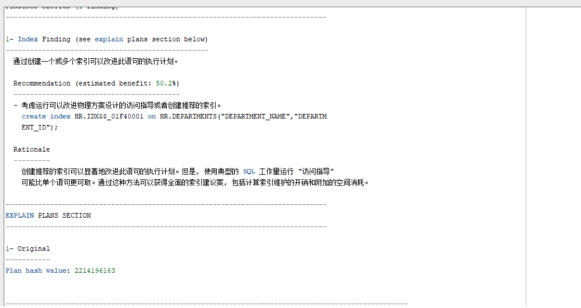
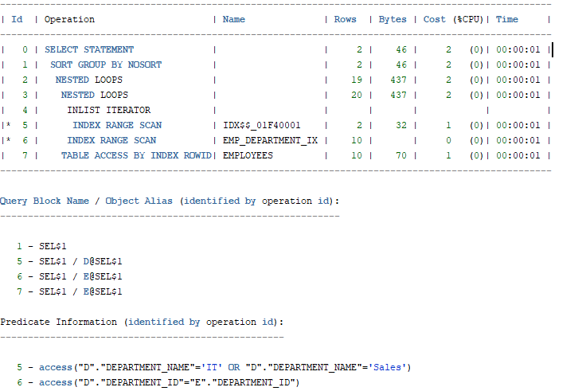
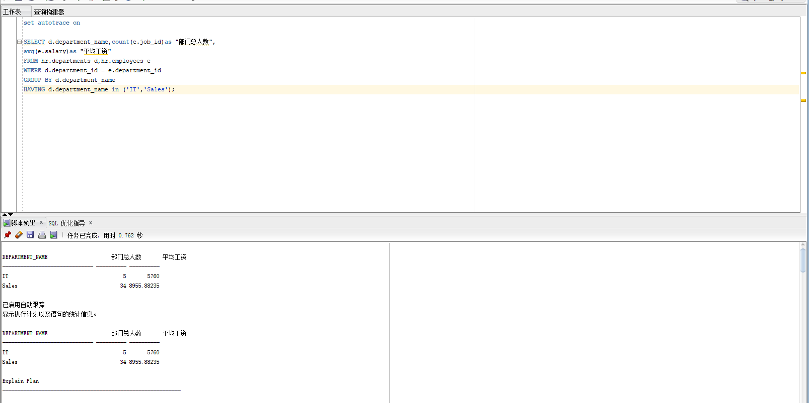
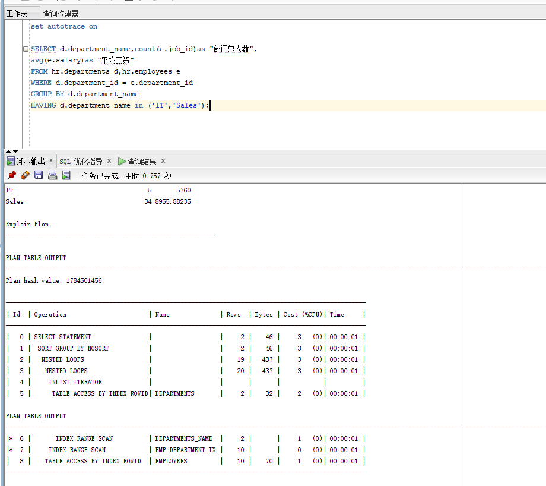
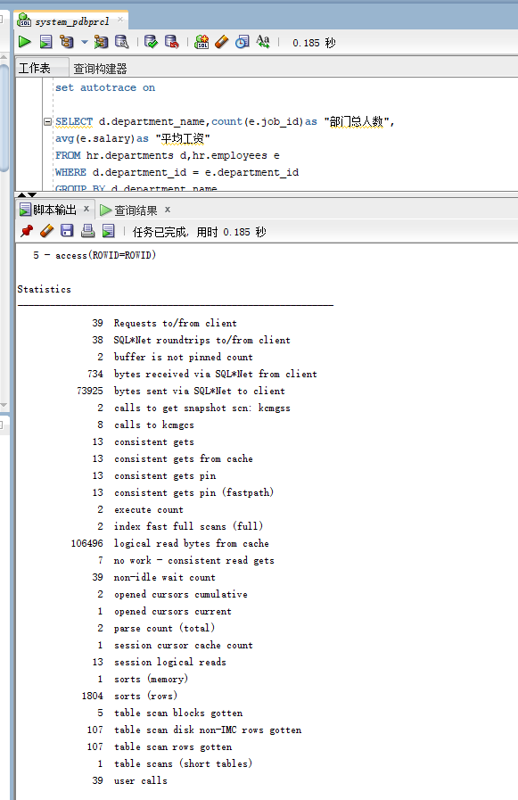
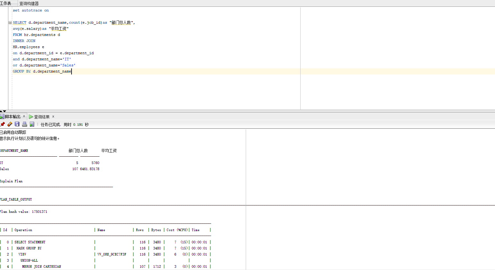
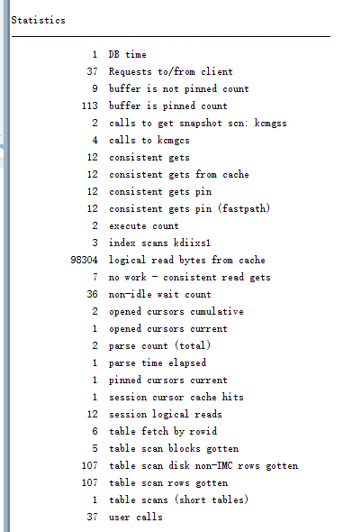

# oracle第一次作业
- ## 测试一(书)
第一个测试,可优化,效率较高
cost=5,rows=20,predicate information中有一次索引搜索access,一次全表搜索filter

**在优化中,建议我们在deoartments表上创建一个基于DEPARTMENT_NAME和DEPARTMENT_ID字段的索引,
这样就可以加快查询DEPARTMENT_NAME的速度.在创建这个索引之后,可以看到查询1的执行计划如下图,
对比可以看出,谓词中已没有全表搜索filter,之有索引搜索access,其他性能指标也随之提升了.

- ## 测试二(书)
第二个测试,效率比第一个低
cost=7,rwos=106,predicate information中有一次索引搜索access,两次全表搜索filter

- ### 总结测试一二 ###
 **查询1比2更优,因为查询1除了"consistent gets=10"比查询2的"consistent gets=9"稍差,其他的都优于2**
- ## 测试三(自己编写查询语句)
自己编写的查询语句,效率一般,不过运用了INNER JOIN 方法

