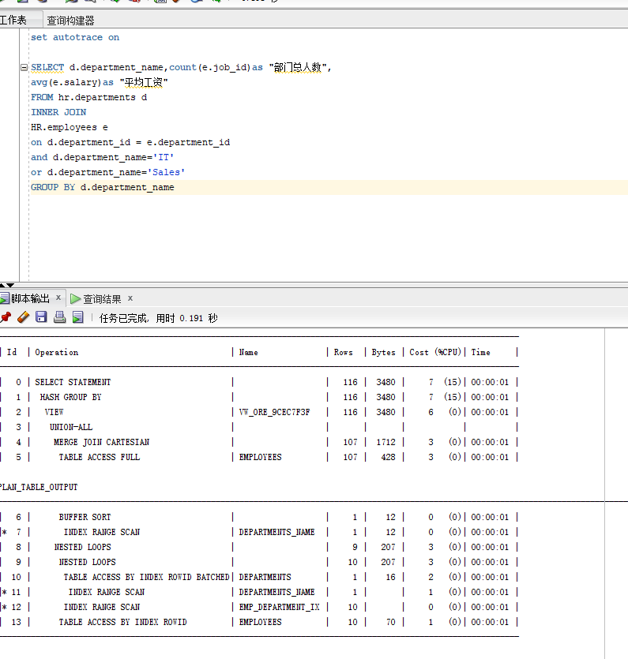

# oracle第一次作业,李东声_201810414116 _软工一班
- ## 实验目的
分析SQL执行计划，执行SQL语句的优化指导。理解分析SQL语句的执行计划的重要作用。
- ## 实验内容
对Oracle12c中的HR人力资源管理系统中的表进行查询与分析。
    首先运行和分析教材中的样例：本训练任务目的是查询两个部门('IT'和'Sales')的部门总人数和平均工资，以下两个查询的结果是一样的。但效率不相同。
    设计自己的查询语句，并作相应的分析，查询语句不能太简单。
- ## 测试一
第一个测试,可优化,效率较高
cost=5,rows=20,predicate information中有一次索引搜索access,一次全表搜索filter   
code:  
set autotrace on  
SELECT d.department_name,count(e.job_id)as "部门总人数",  
avg(e.salary)as "平均工资"  
from hr.departments d,hr.employees e  
where d.department_id = e.department_id  
and d.department_name in ('IT','Sales')  
GROUP BY d.department_name;  
 

在优化中,建议我们在deoartments表上创建一个基于DEPARTMENT_NAME和DEPARTMENT_ID字段的索引,
这样就可以加快查询DEPARTMENT_NAME的速度.在创建这个索引之后,可以看到查询1的执行计划如下图,
对比可以看出,谓词中已没有全表搜索filter,之有索引搜索access,其他性能指标也随之提升了.

- ## 测试二
第二个测试,效率比第一个低
cost=7,rwos=106,predicate information中有一次索引搜索access,两次全表搜索filter    
code:  
set autotrace on  
SELECT d.department_name,count(e.job_id)as "部门总人数",  
avg(e.salary)as "平均工资"  
FROM hr.departments d,hr.employees e  
WHERE d.department_id = e.department_id  
GROUP BY d.department_name  
HAVING d.department_name in ('IT','Sales');  

- ### 测试一二对比: ###
-**查询1比2更优,因为查询1除了"consistent gets=10"比查询2的"consistent gets=9"稍差,其他的都优于2**
- ## 自编写测试
自己编写的查询语句,运用了INNER JOIN 方法,大体结构和原表有一定变化  
code:  
set autotrace on   
SELECT d.department_name,count(e.job_id)as "部门总人数",    
avg(e.salary)as "平均工资"    
FROM hr.departments d  
INNER JOIN  
hr.employees e  
on  d.department_id = e.department_id  
and d.department_name='IT'  
or d.department_name='Sales'  
GROUP BY d.department_name 

