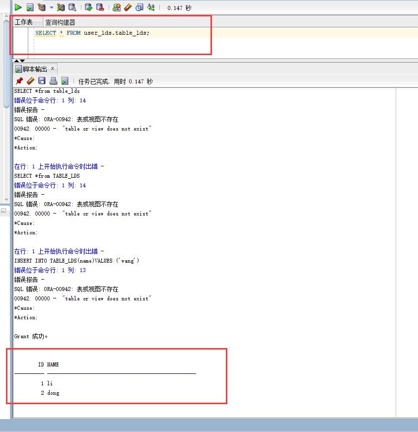
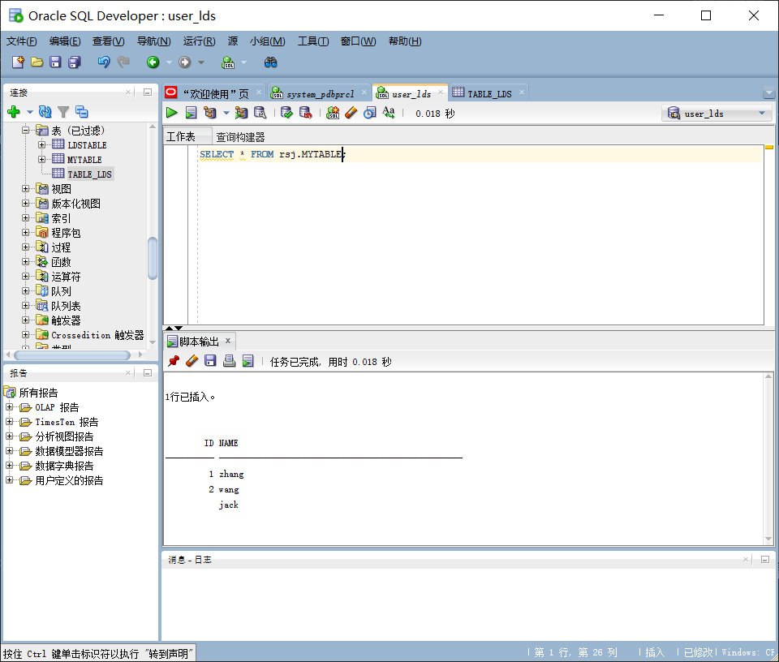

# oracle第二次实验,李东声_201810414116 _软工一班 
## 实验目的
- 掌握用户管理、角色管理、权根维护与分配的能力，掌握用户之间共享对象的操作技能。

## 实验内容
Oracle有一个开发者角色resource，可以创建表、过程、触发器等对象，但是不能创建视图。本训练要求：

- 在pdborcl插接式数据中创建一个新的本地角色con_res_view，该角色包含connect和resource角色，同时也包含CREATE VIEW权限，这样任何拥有con_res_view的用户就同时拥有这三种权限。
- 创建角色之后，再创建用户new_user，给用户分配表空间，设置限额为50M，授予con_res_view角色。
- 最后测试：用新用户new_user连接数据库、创建表，插入数据，创建视图，查询表和视图的数据。
## 实验具体步骤
### 第1步：以system登录到pdborcl，创建角色lds_view和用户new_user，并授权和分配空间：  
$ sqlplus system/123@pdborcl  
SQL> CREATE ROLE lds_view;  
Role created.  
SQL> GRANT connect,resource,CREATE VIEW TO lds_view;  
Grant succeeded.  
SQL> CREATE USER user_lds IDENTIFIED BY 123 DEFAULT TABLESPACE users TEMPORARY TABLESPACE temp;  
User created.  
SQL> ALTER USER user_lds QUOTA 50M ON users;  
User altered.  
SQL> GRANT lds_view TO user_lds;  
Grant succeeded.  
SQL> exit   
- 创建用户

- 分配空间

- grant

- 退出

### 第2步：新用户user_lds连接到pdborcl，创建表table_lds和视图myview，插入数据，最后将myview的SELECT对象权限授予rsj用户。
$ sqlplus new_user/123@pdborcl  
SQL> show user;  
USER is "NEW_USER"  
SQL> CREATE TABLE mytable (id number,name varchar(50));  
Table created.  
SQL> INSERT INTO mytable(id,name)VALUES(1,'zhang');  
1 row created.  
SQL> INSERT INTO mytable(id,name)VALUES (2,'wang');  
1 row created.  
SQL> CREATE VIEW myview AS SELECT name FROM mytable;  
View created.  
SQL> SELECT * FROM myview;  
NAME  
li
dong
SQL> GRANT SELECT ON myview TO rsj;
Grant succeeded.
SQL>exit  
- 当前用户

- 创建表格

- 插入数据

- 创建view

- 展示表

### 第3步：用户rsj连接到pdborcl，查询user_lds授予它的视图myview
- 给权限

- rsj端看user_lds的表

- user_lds看rsj的表
