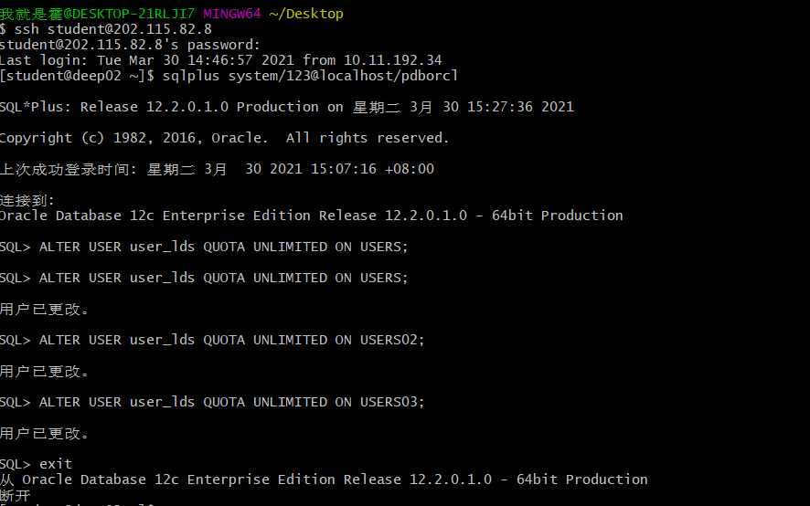
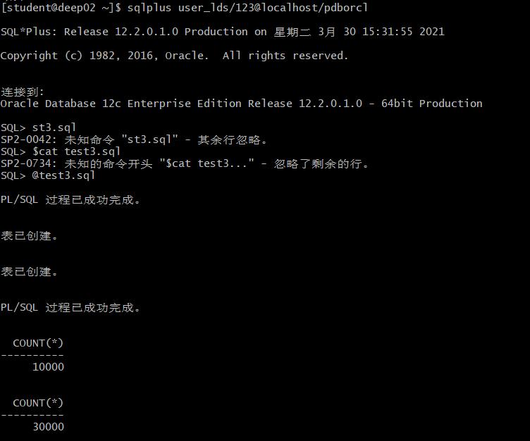
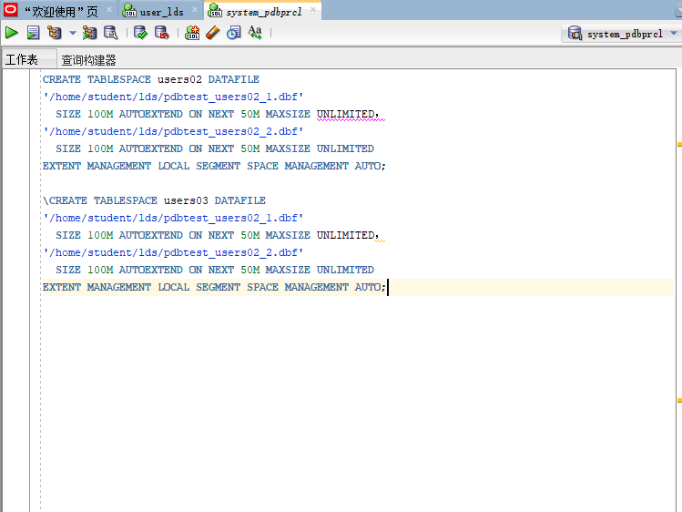
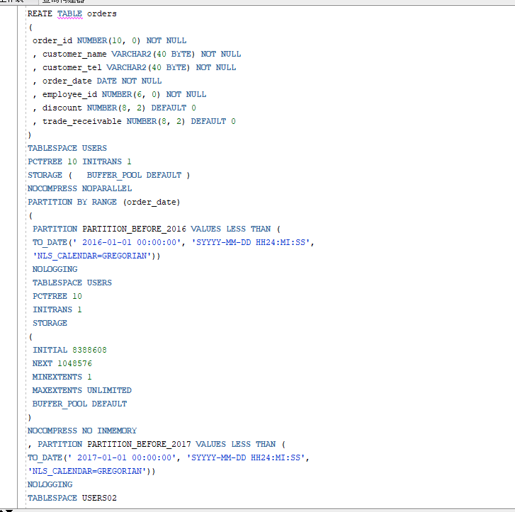
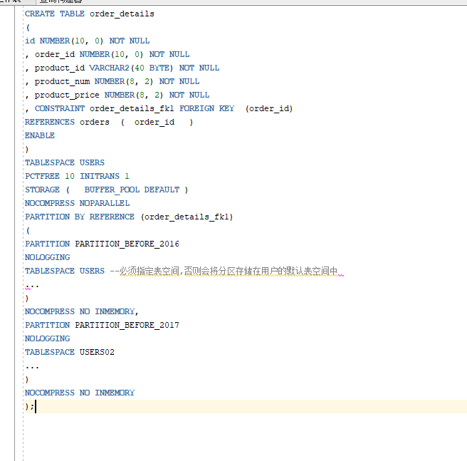

# oracle第三次实验,李东声_201810414116 _软工一班 
## 实验目的
掌握分区表的创建方法，掌握各种分区方式的使用场景。

## 实验内容
- 本实验使用3个表空间：USERS,USERS02,USERS03。在表空间中创建两张表：订单表(orders)与订单详表(order_details)。
- 使用你自己的账号创建本实验的表，表创建在上述3个分区，自定义分区策略。
- 你需要使用system用户给你自己的账号分配上述分区的使用权限。你需要使用system用户给你的用户分配可以查询执行计划的权限。
- 表创建成功后，插入数据，数据能并平均分布到各个分区。每个表的数据都应该大于1万行，对表进行联合查询。
- 写出插入数据的语句和查询数据的语句，并分析语句的执行计划。
- 进行分区与不分区的对比实验。

## 实验具体步骤
### 第1步： 首先创建自己的账号your_user，然后以system身份登录:
 

'''

### 第2步：然后以自己的账号your_user身份登录,并运行脚本文件test3.sql:：

### 【示例8-11】在主表orders和从表order_details之间建立引用分区 在study用户中创建两个表：orders（订单表）和order_details（订单详表），两个表通过列order_id建立主外键关联。orders表按范围分区进行存储，order_details使用引用分区进行存储。 创建orders表的部分语句是：

- 创建order_details表的部分语句如下：

## 查看数据库的使用情况
### 以下样例查看表空间的数据库文件，以及每个文件的磁盘占用情况。
- autoextensible是显示表空间中的数据文件是否自动增加。
- MAX_MB是指数据文件的最大容量。
