# 实验6（期末考核） 基于Oracle的游戏账号租借项目数据库设计 
## 李东声_201810414116 _软工一班 

## 期末考核要求


- 自行设计一个信息系统的数据库项目，自拟某项目名称。
+ 设计项目涉及的表及表空间使用方案。至少5张表和5万条数据，两个表空间。
- 设计权限及用户分配方案。至少两类角色，两个用户。
- 在数据库中建立一个程序包，在包中用PL/SQL语言设计一些存储过程和函数，实现比较复杂的业务逻辑，用模拟数据进行执行计划分析。
- 设计自动备份方案或则手工备份方案。
- 设计容灾方案。使用两台主机，通过DataGuard实现数据库整体的异地备份(可选)。


## 实验注意事项，完成时间： 2021-6-15日前上交


- 实验在自己的计算机上完成。
- 文档必须提交到你的Oracle项目中的test6目录中。文档必须上传两套，因此你的test6目录中必须至少有两个文件：
   一个是Markdown格式的，文件名称是test6.md。
- 另一个是Word格式的，文件名称是test6_design.docx。参见test6_design.docx，文件不用打印。
上交后，通过这个地址应该可以打开你的源码：https://github.com/你的用户名/oracle/tree/master/test6
文档中所有设计和数据都必须是你自己独立完成的真实实验结果。不得抄袭，杜撰。


## 实验内容
### 1.功能需求模块和联系
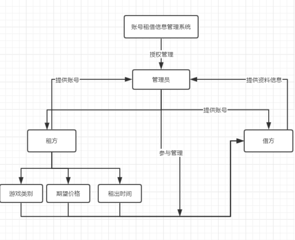
### 2.E-R图
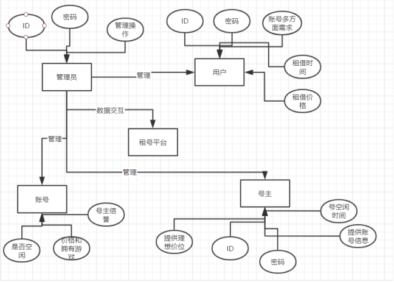
### 3.数据库表设计
- 1
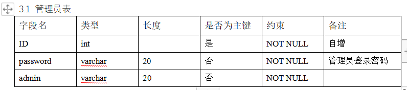
- 2 
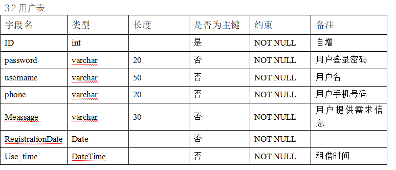
- 3
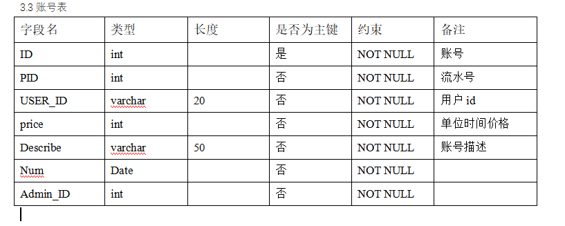
- 4
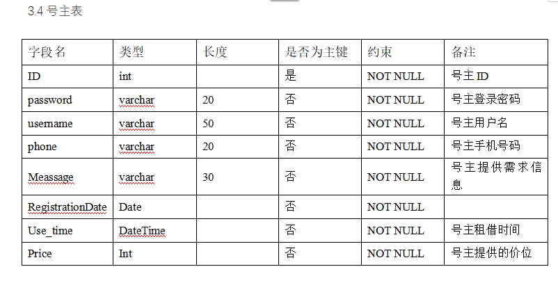
### 表设计
```
/*第1步：创建表空间 **/
space_qhl001
Create Tablespace space_qhl001
datafile
'/home/oracle/app/oracle/oradata/orcl/pdborcl/pdbtest_qhl001_1.dbf'
  SIZE 100M AUTOEXTEND ON NEXT 256M MAXSIZE UNLIMITED,
'/home/oracle/app/oracle/oradata/orcl/pdborcl/pdbtest_qhl001_2.dbf'
  SIZE 100M AUTOEXTEND ON NEXT 256M MAXSIZE UNLIMITED
EXTENT MANAGEMENT LOCAL SEGMENT SPACE MANAGEMENT AUTO;

space_qhl002
Create Tablespace space_qhl002
datafile
'/home/oracle/app/oracle/oradata/orcl/pdborcl/pdbtest_qhl002_1.dbf'
  SIZE 100M AUTOEXTEND ON NEXT 256M MAXSIZE UNLIMITED,
'/home/oracle/app/oracle/oradata/orcl/pdborcl/pdbtest_qhl002_2.dbf'
  SIZE 100M AUTOEXTEND ON NEXT 256M MAXSIZE UNLIMITED
EXTENT MANAGEMENT LOCAL SEGMENT SPACE MANAGEMENT AUTO;
```

```
/*
	创建用户gameleaseholder, gamemanger
*/
create role borrow;
create role sale;
/* 创建两个角色*/
grant borrow to gameleaseholder;
grant sale to gamemanger;

/*第4步：给用户授予权限 */
grant create session, create table to gameleaseholder;
grant connect,resource to gamemanger;
```
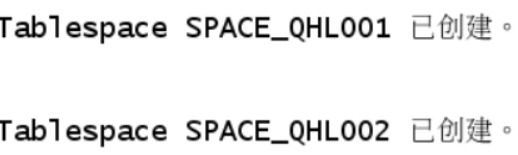

```
创建管理员表
•id 为主键
CREATE TABLE ADMINISTRATOR
(
  ID NUMBER(*, 0) NOT NULL
, PASSWORD VARCHAR2(20 BYTE) NOT NULL
, ADMIN VARCHAR2(20 BYTE) NOT NULL
, CONSTRAINT ADMINISTRATOR_PK PRIMARY KEY
  (
    ID
  )
  USING INDEX
  (
      CREATE UNIQUE INDEX ADMINISTRATOR_PK ON ADMINISTRATOR (ID ASC)
      LOGGING
      TABLESPACE SPACE_QHL001
      PCTFREE 10
      INITRANS 2
      STORAGE
      (
        BUFFER_POOL DEFAULT
      )
      NOPARALLEL
  )
  ENABLE
)
LOGGING
TABLESPACE SPACE_QHL001
PCTFREE 10
INITRANS 1
STORAGE
(
  BUFFER_POOL DEFAULT
)
NOCOMPRESS
NO INMEMORY
NOPARALLEL;

创建用户表
•id 为主键
•根据注册日期按范围分区
•分为 2018 和 2019 年两个分区，每年按季度划 4 个子分区
CREATE TABLE BOOKUSER
(
  ID NUMBER(*, 0) NOT NULL
, PASSWORD VARCHAR2(20 BYTE) NOT NULL
, USERNAME VARCHAR2(50 BYTE) NOT NULL
, PHONE VARCHAR2(20 BYTE) NOT NULL
, ADDRESS VARCHAR2(30 BYTE) NOT NULL
, REGISTRATIONDATE DATE NOT NULL
, CART_ID NUMBER(*, 0) NOT NULL
, CONSTRAINT U_PK PRIMARY KEY
  (
    ID
  )
  USING INDEX
  (
      CREATE UNIQUE INDEX U_PK ON BOOKUSER (ID ASC)
      LOGGING
      TABLESPACE SPACE_QHL001
      PCTFREE 10
      INITRANS 2
      STORAGE
      (
        BUFFER_POOL DEFAULT
      )
      NOPARALLEL
  )
  ENABLE
)
TABLESPACE SPACE_QHL001
PCTFREE 10
INITRANS 1
STORAGE
(
  BUFFER_POOL DEFAULT
)
NOCOMPRESS
NOPARALLEL
PARTITION BY RANGE (REGISTRATIONDATE)
SUBPARTITION BY RANGE (REGISTRATIONDATE)
(
  PARTITION DATE2018 VALUES LESS THAN (TO_DATE(' 2018-12-31 00:00:00', 'SYYYY-MM-DD HH24:MI:SS', 'NLS_CALENDAR=GREGORIAN'))
  TABLESPACE SPACE_QHL001
  PCTFREE 10
  INITRANS 1
  STORAGE
  (
    BUFFER_POOL DEFAULT
  )
  NOCOMPRESS NO INMEMORY
  (
    SUBPARTITION DATE2018_3 VALUES LESS THAN (TO_DATE(' 2018-03-31 00:00:00', 'SYYYY-MM-DD HH24:MI:SS', 'NLS_CALENDAR=GREGORIAN'))
    NOCOMPRESS NO INMEMORY
  , SUBPARTITION DATE2018_6 VALUES LESS THAN (TO_DATE(' 2018-06-30 00:00:00', 'SYYYY-MM-DD HH24:MI:SS', 'NLS_CALENDAR=GREGORIAN'))
    NOCOMPRESS NO INMEMORY
  , SUBPARTITION DATE2018_9 VALUES LESS THAN (TO_DATE(' 2018-09-30 00:00:00', 'SYYYY-MM-DD HH24:MI:SS', 'NLS_CALENDAR=GREGORIAN'))
    NOCOMPRESS NO INMEMORY
  , SUBPARTITION DATE2018_12 VALUES LESS THAN (TO_DATE(' 2018-12-31 00:00:00', 'SYYYY-MM-DD HH24:MI:SS', 'NLS_CALENDAR=GREGORIAN'))
    NOCOMPRESS NO INMEMORY
  )
, PARTITION DATE2019 VALUES LESS THAN (TO_DATE(' 2019-12-31 00:00:00', 'SYYYY-MM-DD HH24:MI:SS', 'NLS_CALENDAR=GREGORIAN'))
  TABLESPACE SPACE_QHL001
  PCTFREE 10
  INITRANS 1
  STORAGE
  (
    BUFFER_POOL DEFAULT
  )
  NOCOMPRESS NO INMEMORY
  (
    SUBPARTITION DATE2019_3 VALUES LESS THAN (TO_DATE(' 2019-03-31 00:00:00', 'SYYYY-MM-DD HH24:MI:SS', 'NLS_CALENDAR=GREGORIAN'))
    NOCOMPRESS NO INMEMORY
  , SUBPARTITION DATE2019_6 VALUES LESS THAN (TO_DATE(' 2019-06-30 00:00:00', 'SYYYY-MM-DD HH24:MI:SS', 'NLS_CALENDAR=GREGORIAN'))
    NOCOMPRESS NO INMEMORY
  , SUBPARTITION DATE2019_9 VALUES LESS THAN (TO_DATE(' 2019-09-30 00:00:00', 'SYYYY-MM-DD HH24:MI:SS', 'NLS_CALENDAR=GREGORIAN'))
    NOCOMPRESS NO INMEMORY
  , SUBPARTITION DATE2019_12 VALUES LESS THAN (TO_DATE(' 2019-12-31 00:00:00', 'SYYYY-MM-DD HH24:MI:SS', 'NLS_CALENDAR=GREGORIAN'))
    NOCOMPRESS NO INMEMORY
  )
);
```

```
创建商品表
CREATE TABLE COMMODITY
(
  ID NUMBER(*, 0) NOT NULL
, PID NUMBER(*, 0) NOT NULL
, BOOKSNAME VARCHAR2(20 BYTE) NOT NULL
, PRICE NUMBER NOT NULL
, DESCRIBE VARCHAR2(50 BYTE) NOT NULL
, NUM NUMBER(*, 0) NOT NULL
, ADMIN_ID NUMBER(*, 0) NOT NULL
, CONSTRAINT COMMODITY_PK PRIMARY KEY
  (
    ID
  )
  USING INDEX
  (
      CREATE UNIQUE INDEX COMMODITY_PK ON COMMODITY (ID ASC)
      LOGGING
      TABLESPACE SPACE_QHL001
      PCTFREE 10
      INITRANS 2
      STORAGE
      (
        BUFFER_POOL DEFAULT
      )
      NOPARALLEL
  )
  ENABLE
)
LOGGING
TABLESPACE SPACE_QHL001
PCTFREE 10
INITRANS 1
STORAGE
(
  BUFFER_POOL DEFAULT
)
NOCOMPRESS
NO INMEMORY
NOPARALLEL;
```
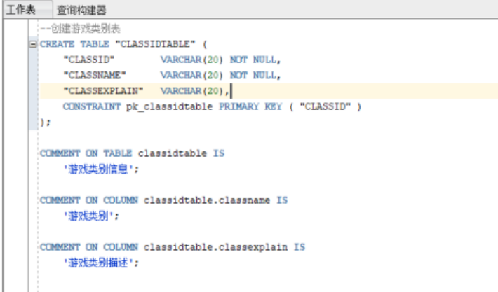
```
--创建管理员表
CREATE TABLE "MANGER" (
    "ID"         VARCHAR(20) NOT NULL,
    "NAME"       VARCHAR(20) NOT NULL,
    CONSTRAINT pk_MANGER PRIMARY KEY ( "ID" )
);
comment on table Manger is '管理员信息';
comment on column Manger.ID is '主键: 唯一标识管理员';
comment on Column Manger.name is '姓名';

--创建租借者表
CREATE TABLE "LEASEHOLDER" (
    "LEASEHOLDERID"     VARCHAR(20) NOT NULL,
    "LEASEHOLDERCLASS"  VARCHAR(20) NOT NULL,
    "LEASEHOLDERNAME"   VARCHAR(20),
    "TIME"     VARCHAR(20),
    CONSTRAINT pk_LEASEHOLDER PRIMARY KEY ("LEASEHOLDERID")
);
comment on table Leaseholder is '租借者基本信息';
comment on column Leaseholder.LEASEHOLDERID is '主键: 唯一标识';
commnent on Column Leaseholder.LEASEHOLDERNAME is '租借者姓名';
commnent on Column Leaseholder.TIME is '租借时间';
```
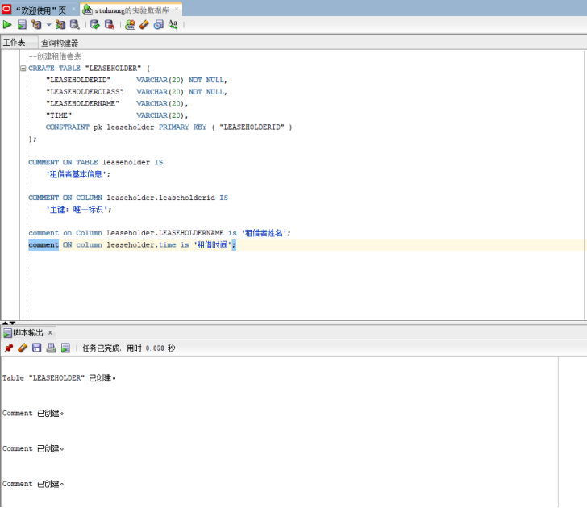
```
/*
插入用户、账号、号主数据
*/
declare
  id number(38,0);
  username varchar2(50);
  phone varchar2(20);
  address varchar2(30);
  REGISTRATIONDATE date;
  booksname varchar2(50);
  price number(5,2);
  num number(38,0);
  amount number(38,0);

begin
  for i in 1..50000
  loop
    if i mod 2 =0 then
      REGISTRATIONDATE:=to_date('2018-5-6','yyyy-mm-dd')+(i mod 60);
    else
      REGISTRATIONDATE:=to_date('2019-5-6','yyyy-mm-dd')+(i mod 60);
    end if;

    --插入用户
    id:=SEQ_ORDER_ID.nextval; --应该将SEQ_ORDER_ID.nextval保存到变量中。
    username := '李东声|| 'aa';
    username := '李东声' || i;
    phone := '131785693' || i;
	booksname := 'LOL账号' || i;
	address :='成都'|| '四川';
	price :=(dbms_random.value() * 100);
	num :=(i mod 5);
    insert /*+append*/ into user (id,password,username,phone,address,REGISTRATIONDATE,cart_id)
      values (id,username,username,phone,address,REGISTRATIONDATE,id);
	--插入货品

	insert into commodity(id,pid,name,price,describe,num,admin_id)
		values (id,id,booksname,price,'good',num,1);
	--插入账号选择
	amount :=(id mod 3 ) + 1;
	insert into cart(id,amount,pid,bookuser_id)
	 	values (id,amount,id,id);

    IF I MOD 1000 =0 THEN
      commit; --每次提交会加快插入数据的速度
    END IF;
  end loop;
end;
```

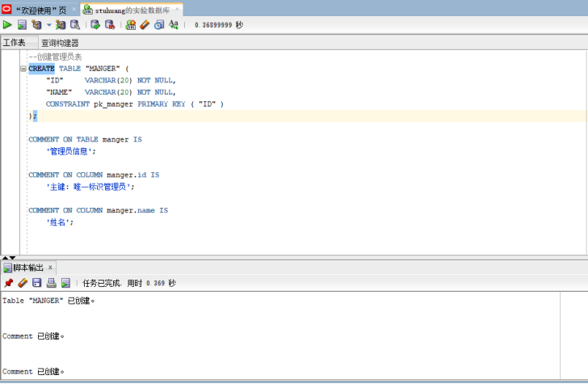
```
/*查看数据*/

 select * from GAME;
 select * from MANGER
 select * from LEASEHOLDER;
 select * from LEASEHOLDERCLASS;
 select * from CLASSIDTABLE;


使用存储过程 adduser 插入用户数据
set serveroutput on
declare
begin
BOOK_PACKAGE.addUser('131','wwj','123456','hongkong','2021-06-12');
end;

表空间使用状况
SELECT a.tablespace_name "表空间名",
total "表空间大小",
free "表空间剩余大小",
(total - free) "表空间使用大小",
total / (1024 * 1024 * 1024) "表空间大小(G)",
free / (1024 * 1024 * 1024) "表空间剩余大小(G)",
(total - free) / (1024 * 1024 * 1024) "表空间使用大小(G)",
round((total - free) / total, 4) * 100 "使用率 %"
FROM (SELECT tablespace_name, SUM(bytes) free
FROM dba_free_space
GROUP BY tablespace_name) a,
(SELECT tablespace_name, SUM(bytes) total
FROM dba_data_files
/*备份*/
```
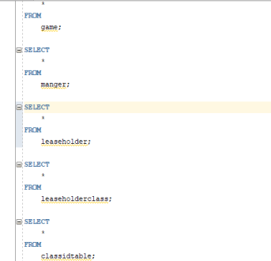
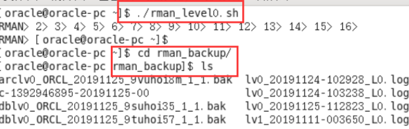
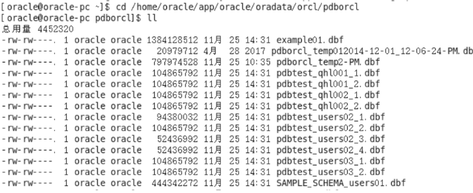


